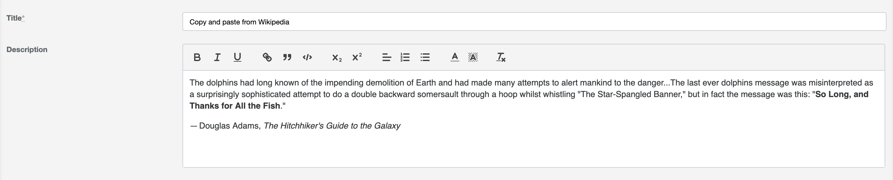

# ActiveAdmin Quill Editor
[](https://badge.fury.io/rb/activeadmin_quill_editor)
[](https://rubygems.org/gems/activeadmin_quill_editor)
[](https://github.com/blocknotes/activeadmin_quill_editor/actions/workflows/linters.yml)
[](https://github.com/blocknotes/activeadmin_quill_editor/actions/workflows/specs_rails61.yml)
[](https://github.com/blocknotes/activeadmin_quill_editor/actions/workflows/specs_rails70.yml)

An Active Admin plugin to use [Quill Rich Text Editor](https://github.com/quilljs/quill) in form fields.



Please :star: if you like it.

## Install

_NOTE_: Ruby 2.7 is supported until version 1.1.0

After installing Active Admin, add to your Gemfile: `gem 'activeadmin_quill_editor'` (and execute *bundle*)

If you installed Active Admin without Webpacker support (default for now):

- Add a SASS/SCSS gem to your Gemfile (ex. `gem 'sassc'`)
- Add at the end of your Active Admin styles (_app/assets/stylesheets/active_admin.scss_):
```scss
@import 'activeadmin/quill_editor/quill.snow';
@import 'activeadmin/quill_editor_input';
```
- Add at the end of your Active Admin javascripts (_app/assets/javascripts/active_admin.js_):
```js
//= require activeadmin/quill_editor/quill
//= require activeadmin/quill_editor_input
```

> **UPDATE FROM VERSION <= 2.0**: please add to your _app/assets/stylesheets/active_admin.scss_ the line `@import 'activeadmin/quill_editor/quill.snow';`

If you installed Active Admin with Webpacker support:

- Execute in your project root:
```sh
yarn add blocknotes/activeadmin_quill_editor
```
- Add to your *app/javascript/packs/active_admin.js*:
```js
require('activeadmin_quill_editor')
```

## Usage

In your Active Admin models, form configuration, set the text inputs with `as: :quill_editor` where needed.

**data-options**: permits to set *quill editor* options directly - see [options list](https://quilljs.com/docs/configuration/)

If you are using Action Text (`has_rich_text`) on the same field of the Quill editor please take a look at [this workaround](https://github.com/blocknotes/activeadmin_quill_editor/issues/33#issuecomment-1965996947) to avoid issues.

## Examples

### Basic usage

```ruby
# Active Admin article form conf:
  form do |f|
    f.inputs 'Article' do
      f.input :title
      f.input :description, as: :quill_editor
      f.input :published
    end
    f.actions
  end
```

### Toolbar buttons configuration

```ruby
f.input :description, as: :quill_editor, input_html: { data: { options: { modules: { toolbar: [['bold', 'italic', 'underline'], ['link']] }, placeholder: 'Type something...', theme: 'snow' } } }
```

### ImageUploader plugin

This plugin allows to upload images to the server (instead of storing them in *base64* by default), reference [here](https://github.com/NoelOConnell/quill-image-uploader).

```ruby
# Upload method (to be included in the admin entity configuration)
member_action :upload, method: [:post] do
  result = { success: resource.images.attach(params[:file_upload]) }
  result[:url] = url_for(resource.images.last) if result[:success]
  render json: result
end
```

```ruby
# Form field
unless object.new_record?
  plugin_opts = { image_uploader: { server_url: upload_admin_post_path(object.id), field_name: 'file_upload' } }
  f.input :description, as: :quill_editor, input_html: { data: { plugins: plugin_opts } }
end
```

For the relevant files of the upload example see [here](examples/upload_plugin_using_activestorage/).
Consider that this is just a basic example: images are uploaded as soon as they are attached to the
 editor (regardless of the form submit), it shows the editor only for an existing record (because of
the *upload_admin_post_path*) and it doesn't provide a way to remove images (just deleting them from
the editor will not destroy them, you'll need to implement a purge logic for that).

## Changelog

The changelog is available [here](CHANGELOG.md).

## Do you like it? Star it!

If you use this component just star it. A developer is more motivated to improve a project when there is some interest. My other [Active Admin components](https://github.com/blocknotes?utf8=✓&tab=repositories&q=activeadmin&type=source).

Or consider offering me a coffee, it's a small thing but it is greatly appreciated: [about me](https://www.blocknot.es/about-me).

## Contributors

- [Mattia Roccoberton](http://blocknot.es): author
- The good guys that opened issues and pull requests from time to time

## License

The gem is available as open-source under the terms of the [MIT](LICENSE.txt).
